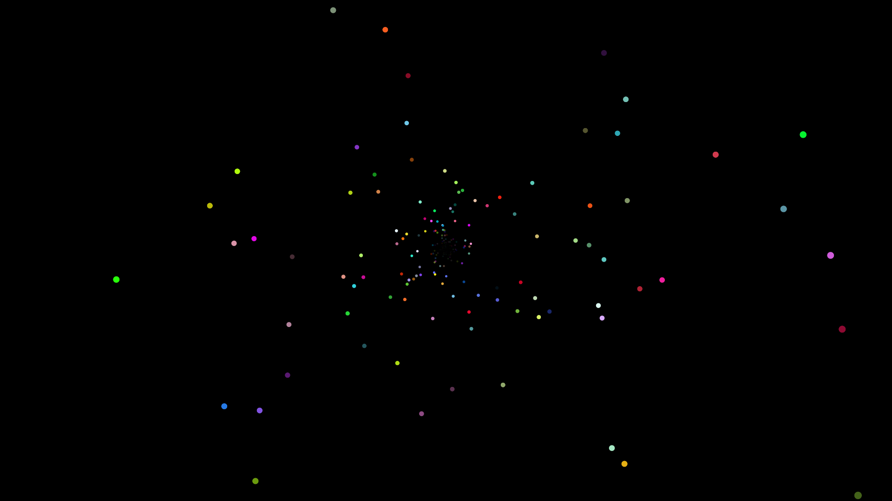

# p5js-starfield

Animated starfield using P5.js library. It is considered more performant than [the AngularJS counterpart](https://github.com/tduyduc/angularjs-starfield).

Tutorial video: https://www.youtube.com/watch?v=kUbeSHEI0JY&list=PLvy39OR5F4Jt3MejfDIau3tRMeTEa4z_Z

